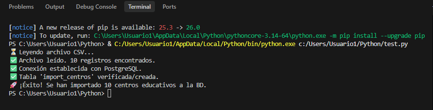
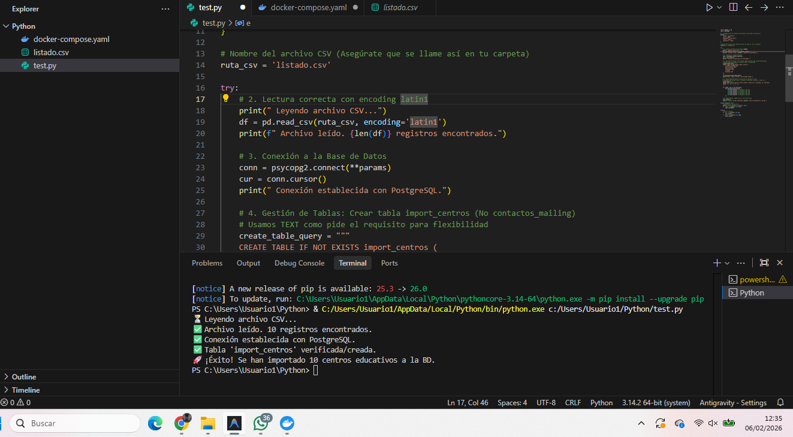
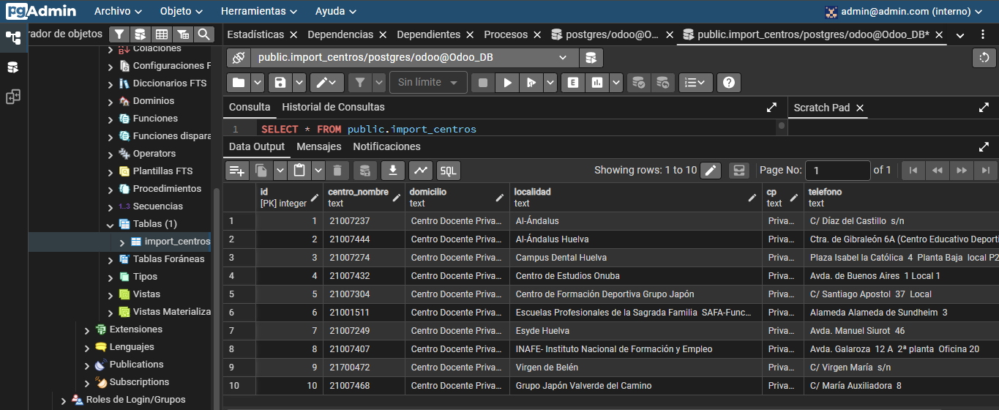

# Proceso ETL: Extracción de Centros Educativos a PostgreSQL con Python y Docker

Este repositorio contiene la resolución de la tarea de administración de sistemas ERP. El objetivo es desarrollar un proceso ETL (Extracción, Transformación y Carga) para volcar un listado externo de colegios (`listado.csv`) en un servidor PostgreSQL corriendo en un entorno Dockerizado.

## 🛠️ Requisitos Técnicos
- **Lenguaje**: Python 3.10+
- **Librerías**: `pandas`, `psycopg2-binary`
- **Infraestructura**: Docker Desktop (Contenedores de Odoo y DB activos)
- **Base de Datos**: PostgreSQL (Puerto 5433 externo)

## 📋 Procedimiento Realizado

1. **Configuración del Entorno**: 
   Se ha utilizado un archivo `docker-compose.yml` para levantar los servicios de Odoo, PostgreSQL y pgAdmin. El puerto de la base de datos se mapeó como `5433:5432` para evitar conflictos locales.

2. **Desarrollo del Script (`importar.py`)**:
   - **Conexión**: Se implementó una conexión robusta mediante un diccionario de credenciales.
   - **Lectura**: Se utilizó Pandas con codificación `latin1` para procesar correctamente caracteres especiales y tildes del archivo CSV.
   - **Gestión de Tablas**: El script crea automáticamente la tabla `import_centros` si no existe, definiendo las columnas como tipo `TEXT`.
   - **Carga de Datos**: Se realizó un bucle mediante `iloc` para recorrer el DataFrame e insertar los registros de forma segura.
   - **Persistencia**: Se incluyó un bloque `try-except-finally` con `commit()` y `rollback()` para asegurar la integridad de la base de datos.

3. **Verificación**: 
   Se comprobó la carga mediante consultas SQL en pgAdmin y la terminal de VS Code.

## 📸 Capturas de Pantalla (Evidencias)

### 1. Conexión Exitosa (test.py)
Esta captura demuestra que la conexión entre Python y el contenedor de Docker es correcta antes de la carga.

### 2. Ejecución del Script de Importación
Terminal de VS Code mostrando el mensaje de éxito tras procesar el archivo CSV.

### 3. Verificación en pgAdmin con Reloj del Sistema
Vista de la tabla `import_centros` con los datos cargados y el reloj del sistema visible (requisito de verificación).

